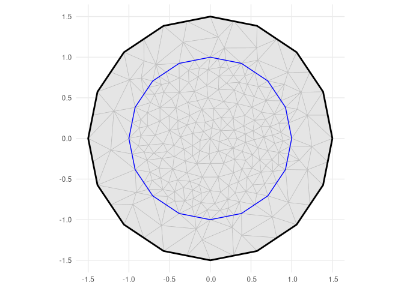
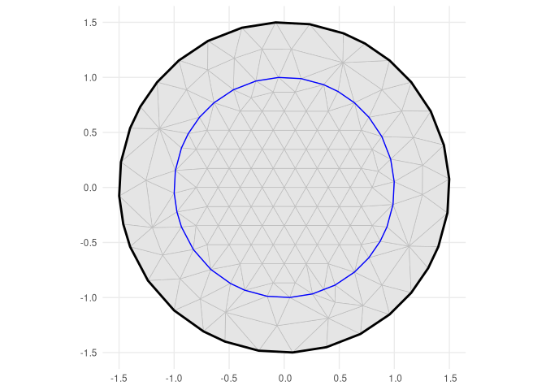
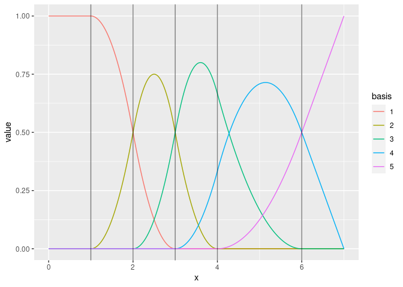

<!-- README.md is generated from README.Rmd. Please edit that file -->

# fmesher: Triangle Meshes and Other Geometry Tools

<!-- badges: start -->

[](https://cran.r-project.org/package=fmesher)
[](https://inlabru-org.r-universe.dev)
[](https://github.com/inlabru-org/fmesher/actions)
[](https://github.com/inlabru-org/fmesher/actions)
[](https://app.codecov.io/gh/inlabru-org/fmesher?branch=devel)
<!-- badges: end -->

Generate planar and spherical triangle meshes, compute finite element
calculations for 1- and 2-dimensional flat and curved manifolds with
associated basis function spaces, methods for lines and polygons, and
transparent handling of coordinate reference systems and coordinate
transformation, including `sf` and `sp` geometries. The core `fmesher`
library code was originally part of the [`INLA`](https://www.r-inla.org)
package, and also distributed in the [EUSTACE Horizon 2020
project](https://github.com/eustace-data/eustace-ambitious), and
implements parts of “Triangulations and Applications” by [Hjelle and
Dæhlen (2006)](https://doi.org/10.1007/3-540-33261-8). The expanded
`crs`/`CRS` support started as an add-on feature of
[`inlabru`](https://inlabru-org.github.io/inlabru/).

## Installation

You can install the current [CRAN
version](https://cran.r-project.org/package=fmesher) version of
`fmesher`:

``` r
install.packages("fmesher")
```

### Installation using [pak](https://pak.r-lib.org/)

You can install the latest bugfix release of fmesher from
[GitHub](https://github.com/inlabru-org/fmesher) with:

``` r
# install.packages("pak")
pak::pkg_install("inlabru-org/fmesher@stable")
```

You can install the development version of inlabru from
[GitHub](https://github.com/inlabru-org/fmesher) with

``` r
pak::pkg_install("inlabru-org/fmesher")
```

or track the development version builds via
[inlabru-org.r-universe.dev](https://inlabru-org.r-universe.dev/builds):

``` r
# Enable universe(s) by inlabru-org
pak::repo_add(inlabruorg = "https://inlabru-org.r-universe.dev")
pak::pkg_install("fmesher")
```

This will pick the r-universe version if it is more recent than the CRAN
version.

To install and run `fmesher` in full debug mode (this is quite an
experience!), use

``` r
# install.packages("pkgbuild")
source("https://raw.githubusercontent.com/inlabru-org/fmesher/devel/misc/build.R")
fmesher_install(repo = "inlabru-org/fmesher", debug = TRUE)
```

### Installation using `remotes`

You can install the latest bugfix release of fmesher from
[GitHub](https://github.com/inlabru-org/fmesher) with:

``` r
# install.packages("remotes")
remotes::install_github("inlabru-org/fmesher", ref = "stable")
```

You can install the development version of fmesher from
[GitHub](https://github.com/inlabru-org/fmesher) with

``` r
remotes::install_github("inlabru-org/fmesher")
```

or track the development version builds via
[inlabru-org.r-universe.dev](https://inlabru-org.r-universe.dev/builds):

``` r
# Enable universe(s) by inlabru-org
options(repos = c(
  inlabruorg = "https://inlabru-org.r-universe.dev",
  getOption("repos")
))
install.packages("fmesher")
```

## Online documentation

<https://inlabru-org.github.io/fmesher/>

## Examples

### 2D triangular meshes

Refined constrained Delaunay triangulations can be constructed by
`fm_rcdt_2d()` and `fm_mesh_2d()`. The `_inla()` versions of these will
usually return the same meshes as the old `INLA` methods,
`INLA::inla.mesh.create()` and `INLA::inla.mesh.2d()`.

``` r
suppressPackageStartupMessages(library(fmesher))
suppressPackageStartupMessages(library(ggplot2))

bnd <- fm_extensions(cbind(0, 0), convex = c(1, 1.5))
(mesh <- fm_mesh_2d_inla(
  boundary = bnd,
  max.edge = c(0.2, 0.5)
))
#> fm_mesh_2d object:
#>   Manifold:  R2
#>   V / E / T: 269 / 772 / 504
#>   Euler char.:   1
#>   Constraints:   Boundary: 32 boundary edges (1 group: 1), Interior: 44 interior edges (1 group: 1)
#>   Bounding box: (-1.499887, 1.499887) x (-1.499887, 1.499887)
#>   Basis d.o.f.:  269
```

``` r
ggplot() +
  geom_fm(data = mesh) +
  theme_minimal()
```



Mostly regular triangulations can be constructed by supplying a regular
set of input points. The (experimental, developed by Man Ho Suen)
`fm_hexagon_lattice()` function generates points in a regular hexagonal
lattice pattern, contained in a given `sf` polygon.

``` r
hex_points <- fm_hexagon_lattice(bnd = bnd[[1]], edge_len = 0.2)
(mesh_hex <- fm_mesh_2d_inla(
  loc = hex_points,
  boundary = bnd,
  max.edge = c(0.3, 0.5)
))
#> fm_mesh_2d object:
#>   Manifold:  R2
#>   V / E / T: 154 / 427 / 274
#>   Euler char.:   1
#>   Constraints:   Boundary: 32 boundary edges (1 group: 1), Interior: 32 interior edges (1 group: 1)
#>   Bounding box: (-1.499887, 1.499887) x (-1.499887, 1.499887)
#>   Basis d.o.f.:  154
```

``` r
ggplot() +
  geom_fm(data = mesh_hex) +
  theme_minimal()
```



### 1D B-spline function spaces

``` r
(mesh <- fm_mesh_1d(c(1, 2, 3, 4, 6),
  boundary = c("neumann", "free"),
  degree = 2
))
#> fm_mesh_1d object:
#>   Manifold:  R1
#>   #{knots}:  5
#>   Interval:  (1, 6)
#>   Boundary:  (neumann, free)
#>   B-spline degree:   2
#>   Basis d.o.f.:  5
```

``` r
ggplot() +
  geom_fm(data = mesh, xlim = c(0, 7))
```



### Extended helper methods for CRS handling

The package provides methods `fm_crs()` and `fm_CRS()` for extracting
CRS information from `sf` and `sp` objects and automatically converts to
the desired output format. The `fm_transform()` wrapper similarly
handles a variety of objects, as well as special handling for converting
between spheres and globes of different radii, e.g. used to map between
the Earth and a unit radius sphere uses as a model of the Earth.

``` r
# longlat for a spherical version of the Earth
print(fm_proj4string(fm_crs("longlat_globe")))
#> [1] "+proj=longlat +ellps=sphere +no_defs"

# longlat for a sphere of radius 1m
print(fm_proj4string(fm_crs("longlat_norm")))
#> [1] "+proj=longlat +R=1 +no_defs"

# A sphere of radius 1m
print(fm_proj4string(fm_crs("sphere")))
#> [1] "+proj=geocent +R=1 +units=m +no_defs"
```
